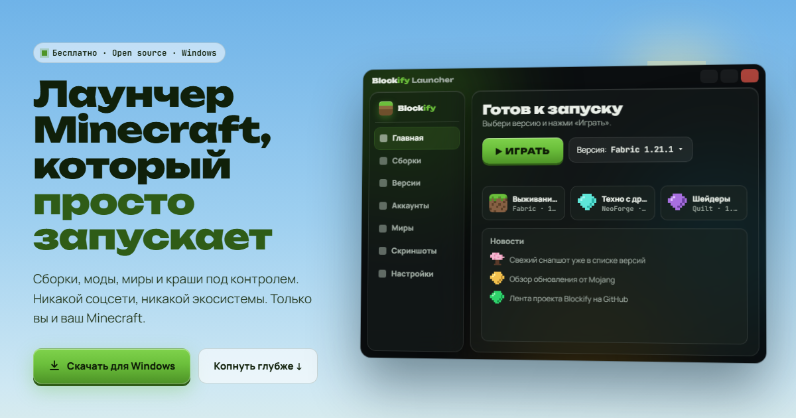

<div align="center">

# Blockify Launcher

**Бесплатный лаунчер для Minecraft: Java Edition на Windows.**
Сборки Modrinth в один клик, моды, миры и краши под контролем — без соцсети и регистрации в лаунчере.

[**⬇ Скачать для Windows**](https://github.com/Blockify-Launcher/Blockify-Launcher/releases) ·
[Сайт](https://blockify-launcher.github.io/Blockify-Launcher/) ·
[Что нового](CHANGELOG.md) ·
[Сообщить о проблеме](https://github.com/Blockify-Launcher/Blockify-Launcher/issues/new/choose)

[](https://github.com/Blockify-Launcher/Blockify-Launcher/actions/workflows/build-and-deploy.yml)
[](https://github.com/Blockify-Launcher/Blockify-Launcher/releases)

[](LICENSE)



</div>

> Blockify не является официальным продуктом Minecraft. Не одобрено и не связано с Mojang или Microsoft.

## Что умеет

**Сборки и моды**
- Каталог сборок Modrinth: поиск, фильтры по версии и загрузчику, установка `.mrpack` в один клик.
- Fabric, Quilt, Forge и NeoForge — Forge и NeoForge ставятся через официальный установщик без ручных действий.
- Изолированные инстансы: у каждой сборки свои моды, конфиги и миры, основная игра не затрагивается.
- Настройки на сборку: своя RAM, Java, JVM-аргументы и размер окна.
- Менеджер модов: включение, выключение, обновление по хешу через Modrinth, установка модов, шейдеров
  и ресурспаков прямо в сборку вместе с зависимостями.
- Буст FPS в один клик — моды производительности под загрузчик сборки; выключается так же просто.
- Импорт из Prism Launcher / MultiMC, CurseForge App и локальных `.mrpack`, экспорт сборки в `.mrpack`.
- Коды `BLK-…` и ссылки `blockify://`: поделитесь сборкой — друг поставит такую же в пару кликов.

**Когда что-то сломалось**
- Crash Doctor: читает краш-репорт и `latest.log`, называет мод-виновника и предлагает исправление в один клик.
- Машина времени: снимки модов и конфигов сборки (сами — перед рискованными изменениями), откат в один клик,
  именованные снимки как профили модов.
- Бэкапы миров основной игры и сборок; восстановление с обязательным страховочным бэкапом текущего мира.

**Остальное**
- Интерфейс «жидкое стекло» на русском, живой фон, панель загрузок, которая не мешает работать.
- Центр скриншотов с альбомами по сборкам и встроенным редактором.
- Локальная статистика игры по каждой сборке — ничего не уходит в сеть.
- Любые версии Minecraft: релизы, снапшоты, старые версии.
- Вход через аккаунт Microsoft и локальные профили для игры без интернета и по локальной сети.

Полный список изменений — в [CHANGELOG.md](CHANGELOG.md).

## Скачать и запустить

1. Откройте [страницу релизов](https://github.com/Blockify-Launcher/Blockify-Launcher/releases) и скачайте
   **`Blockify-portable-win-x64.zip`** (не «Source code»).
2. Распакуйте архив **целиком** в отдельную папку, например `C:\Games\Blockify`.
   Прямо из архива лаунчер не запустится.
3. Запустите `BlockifyLauncher.exe`. Устанавливать .NET не нужно — он уже внутри архива.

**Windows защитила ваш компьютер?** Лаунчер пока не подписан цифровой подписью, поэтому SmartScreen его не узнаёт.
Нажмите «Подробнее» → «Выполнить в любом случае». Скачивайте Blockify только отсюда или с
[сайта](https://blockify-launcher.github.io/Blockify-Launcher/) и сверяйте архив с `SHA256SUMS.txt` из релиза:

```powershell
Get-FileHash .\Blockify-portable-win-x64.zip -Algorithm SHA256
```

### Системные требования

| | Минимум | Рекомендуется |
|---|---|---|
| Система | Windows 10 версии 1607 или новее, Windows 11 — **только 64-бит** | Windows 10 22H2 / Windows 11 |
| Компоненты | [Microsoft Edge WebView2 Runtime](https://developer.microsoft.com/microsoft-edge/webview2/) (в Windows 11 уже есть) | — |
| Память | 4 ГБ ОЗУ | 8 ГБ ОЗУ для сборок с модами |
| Диск | 2 ГБ свободного места | больше — каждая сборка занимает от 0,5 до нескольких ГБ |
| Видеокарта | с поддержкой OpenGL (3.2+ для Minecraft 1.17 и новее) и актуальным драйвером | дискретная |
| Сеть | интернет для первой установки версий и сборок | — |

Windows 7/8.1, 32-битные системы, Linux и macOS не поддерживаются (Linux и macOS — в планах).

### Аккаунт и лицензия игры

Регистрации в самом лаунчере нет. Для официальных серверов, скинов и Realms войдите через аккаунт Microsoft,
на котором куплена Minecraft: Java Edition: страница входа Microsoft открывается во встроенном окне лаунчера,
пароль лаунчер не сохраняет — на вашем ПК хранится только токен входа. Для игры без интернета и по локальной сети
можно создать локальный профиль.

Чтобы играть в Minecraft, игру нужно [купить](https://www.minecraft.net/) — этого требует
[лицензионное соглашение Minecraft (EULA)](https://www.minecraft.net/eula). Blockify не продаёт и не распространяет
саму игру.

## Проблемы и вопросы

- Журнал лаунчера: `%APPDATA%\BlockifyLauncher\logs\launcher.log` — приложите его к
  [сообщению об ошибке](https://github.com/Blockify-Launcher/Blockify-Launcher/issues/new/choose).
- Уязвимости — только приватно, см. [SECURITY.md](.github/SECURITY.md).

---

## Для разработчиков

Оболочка — .NET 8 WPF, весь интерфейс — HTML/CSS/JS в WebView2, связь через мост
`WebMessageReceived` ↔ `PostWebMessageAsJson`. Запуск игры — движок [BlockifyLib](https://github.com/Blockify-Launcher/BlockifyLib)
(сабмодуль `libs/BlockifyLib`, основан на коде CmlLib.Core — см. `libs/BlockifyLib/NOTICE.md`).

### Сборка из исходников

Нужны Windows, [.NET 8 SDK](https://dotnet.microsoft.com/download/dotnet/8.0) и WebView2 Runtime.

```bash
git clone --recurse-submodules https://github.com/Blockify-Launcher/Blockify-Launcher.git
cd Blockify-Launcher

dotnet build BlockifyLauncher.csproj -c Debug
dotnet run --project BlockifyLauncher.csproj
```

Уже клонировали без сабмодулей? `git submodule update --init --recursive`.

Релизная сборка (так же собирает CI):

```bash
dotnet publish BlockifyLauncher.csproj -c Release -r win-x64 --self-contained true -p:DebugType=none -o publish
```

### Структура

```
WebUI/                     интерфейс: index.html, app.js, features/*.js, шрифты
Core/                      Modrinth (каталог, установка .mrpack, обновления модов), новости, фон
MVVM/Views/Window/         MainWindow.*.cs — мост C#↔JS и функции: сборки, моды, Crash Doctor,
                           машина времени, миры, скриншоты, коды BLK-, статистика
libs/BlockifyLib/          движок запуска (сабмодуль)
site/                      лендинг (GitHub Pages)
```

### Релизы

Версия задаётся в `<Version>` в `BlockifyLauncher.csproj`. Релиз — тег `vX.Y.Z` (или `vX.Y.Z-rc1`) на коммите
из `master`: workflow [`release.yml`](.github/workflows/release.yml) проверяет, что версия тега совпадает с проектом,
собирает self-contained `win-x64`, публикует `Blockify-portable-win-x64.zip`, `SHA256SUMS.txt` и подтверждение
происхождения сборки и создаёт **черновик** релиза с описанием из раздела `CHANGELOG.md`.

## Лицензии

- Код Blockify Launcher — [MIT](LICENSE).
- Сторонние компоненты (BlockifyLib/CmlLib.Core, MSAL, WebView2 SDK, Newtonsoft.Json, SharpZipLib, шрифты под SIL OFL
  и другие) — [THIRD-PARTY-NOTICES.txt](THIRD-PARTY-NOTICES.txt). Оба файла лежат и рядом с программой в архиве релиза.
- Minecraft — товарный знак Mojang AB. Blockify не является официальным продуктом Minecraft.
  Не одобрено и не связано с Mojang или Microsoft.

---

<sub>**English summary.** Blockify is a free, open-source (MIT) launcher for Minecraft: Java Edition on Windows 10/11 x64:
one-click Modrinth modpacks in isolated instances (Fabric/Quilt/Forge/NeoForge), per-pack settings, mod manager,
FPS boost, Crash Doctor, snapshots, world backups, share codes. The UI is Russian-only for now.
Download `Blockify-portable-win-x64.zip` from [Releases](https://github.com/Blockify-Launcher/Blockify-Launcher/releases).
Not an official Minecraft product. Not approved by or associated with Mojang or Microsoft.</sub>
